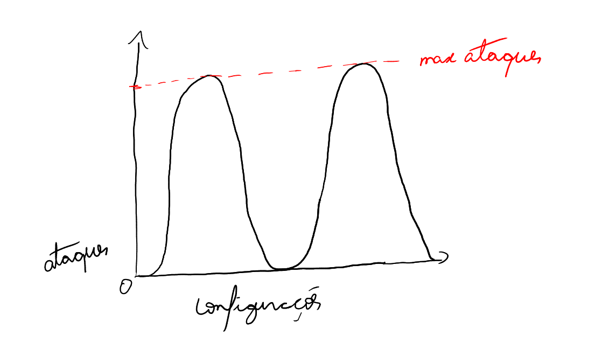
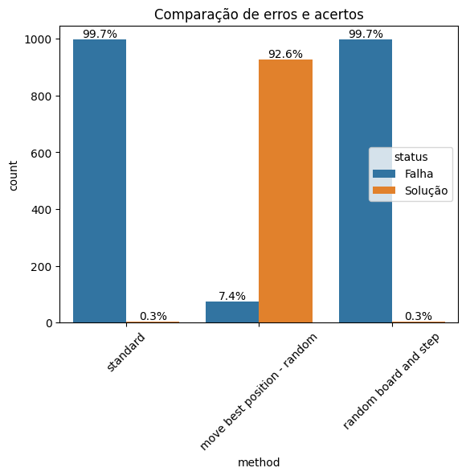
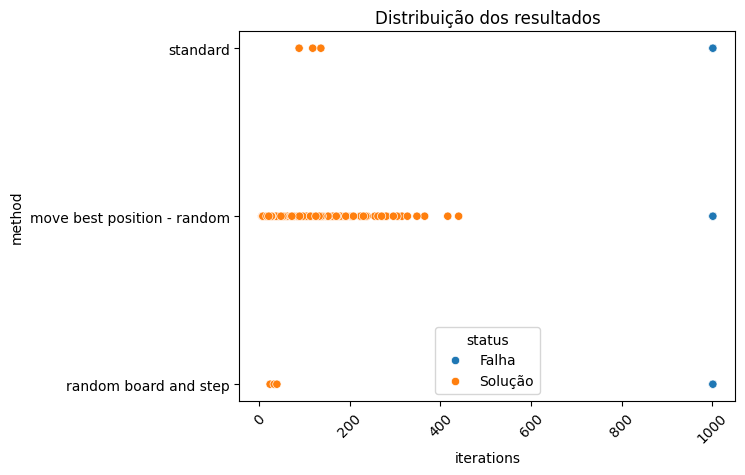

# Resolvendo o problema de local optima - NRainhas

Durante nossas aulas de Inteligência artificial, estávamos estudando sobre algoritmos de busca, mais precisamente o algoritmo de busca informada `Hill Climbing`. Para aprender sobre esse algoritmo, o implementamos para resolver o problema das `N-Rainhas`. Vimos que este é um algoritmo muito bom para resolver o problema rapidamente, contudo este se mostra como muito propenso a ficar estagnado no ótimo local.

Devido a isso, nosso professor [João Ricardo Favan](https://scholar.google.com.br/citations?user=fm6GR6YAAAAJ) nos deu o desafio de encontrar uma maneira de diminuir as chances do algoritmo empacar no ótimo local, e é por isso que estou aqui.

Neste repositório mostrarei a solução que nós encontramos e também o código que foi usado.

## Pensando no problema

Na implementação atual feita pelo nosso professor:

1. geramos um tabuleiro $nxn$ com as rainhas
2. calculamos o total de ataques
3. verificamos se o total de ataques alcançou o mínimo que queríamos (total de $0$ ataques)\
    3.1. caso tenha alcançado, paramos aqui (global optima encontrado)
4. como não encontramos uma solução ótima, movemos uma rainha aleatoriamente e voltamos para 2.

----

Nesse caso do problema das `NRainhas`, poderíamos pensar em uma representação como esta:

Pelo gráfico, podemos ver que cada configuração do tabuleiro $x$ gera um numero de ataques $y$, ou seja $f(x)=y$.

Como nosso objetivo nas `NRainhas` é fazer com que nenhuma rainha seja atacada, poderemos ter diversas configurações que são consideradas global optima.

Dessa forma, nosso problema não necessariamente possui um local optima, mas pela natureza da implementação, não é garantido que ele encontre algum dessas soluções globais. Sendo assim, o algoritmo pode muitas vezes enroscar em um ponto da subida da colina e nunca conseguir chegar de fato ao topo.

## Soluções

Aqui iremos propor 3 soluções possíveis para esse caso. 

### Solução 1 - Remover o passo aleatório

Uma vez que a implementação faz com que o próximo passo seja randômico, não temos a certeza de que o espaço de configurações seja devidamente explorado. Sendo assim, mesmo que executado $10000$ de vezes, ainda há uma pequena probabilidade de não encontrar o ponto máximo.

Para resolver isso, podemos movimentar as rainhas de uma forma mais coordenada. Podemos fazer com que cada rainha mova para a esquerda ou direita baseando-se na quantidade de ataques que cada posição gera, escolhendo a posição com menor número de ataques.

Mesmo sendo uma solução interessante para o problema, podemos ter configurações que se não conseguem evoluir. Para resolver isso, podemos, verificar se a configuração é a mesma da anterior. Caso seja, movemos uma rainha aleatoriamente. Dessa forma, podemos fazer com que o algoritmo sempre tenha algo a melhorar, aumentando as chances de encontrar a solução.

### Solução 2 - Tabuleiros e passos aleatórios

Para a segunda solução, utilizamos o algoritmo padrão, mas dessa vez, iniciamos a busca com uma configuração aleatória e um passo aleatório no intervalo de $[1, n-1]$ sendo $n$ a largura do tabuleiro.

Usando esse método, damos incentivo ao algoritmo testar novas possibilidades e assim evitar ficar preso em um local optima.

### Solução 3 - Outros algoritmos

A solução mais sensata nesse caso, seria pensar em utilizar outro algoritmo que não apresentasse esses problemas que o `Hill Climbing` apresenta.

Utilizar algoritmos como `Simulated Annealing`, `Algoritmos genéticos` ou até mesmo métodos de busca cega/brute force, podem ser interessantes, mesmo que a performance talvez não seja a melhor. 

## Comparações

As soluções propostas foram testadas lado a lado com a implementação original. Para meios de comparação, executamos as $3$ versões $1000$ vezes e salvamos os resultados. `Obs: o tabuleiro usado aqui foi o 9x9`.

Em relação a quantidade de erros e acertos, sem duvidas o primeiro método foi o melhor de todos. Seu método guloso se mostrou muito eficaz para tal problema, conseguindo encontrar a solução a maior parte do tempo.

Outro fator interessante a se observar é que mesmo sendo promissor, a segunda solução dada não conseguiu ter nenhum ganho em relação ao método convencional do `Hill Climbing`.

---

Além disso, podemos verificar a distribuição dos dados:

Nesse caso, vemos que a primeira solução dada consegue encontrar a solução com poucas iterações, contudo possui maior dispersão dos dados, já que utiliza um método randômico internamente.

Podemos também ver que, o ultimo método consegue chegar antes na solução do que o método default. Isso se dá pelo uso de tamanho de passo aleatórios, aumentando a chance de chegar mais rápido ao resultado.

No geral, a soluções com os menores números de passos foram:

método | passos | tamanho do passo
-------|--------|------------------
padrão | 88 | 1
solução 1 | 6 | 1
solução 2 | 24 | 6

### Complexidade

Mesmo com melhores resultados apresentados, devemos levar em consideração a complexidade de tempo de cada versão. Antes de fazer isso, precisamos definir as primitivas e complexidade de funções auxiliares.

Como primitiva, definiremos as funções `calAtaques()` e `locateQueens()`, uma vez que para nossa análise elas não influenciarão, já que sempre serão chamadas $n$ vezes no pior caso. Sendo assim, para esta analise, iremos trata-las como $O(1)$.

Para as funções auxiliares, definiremos as complexidades como:

| função | complexidade |
|--------|--------------|
| `moveRainhaAleatoria()` | $O(1)$, uma vez que a proxima casa sempre estará vazia |
| `moveRainhaMelhorPosicao()` | $O(n^2)$, sendo $n$ o comprimento do tabuleiro |

Com isso podemos dizer que a complexidade para cada versão de implementação é:

| versão | complexidade |
|--------|--------------|
| padrão | $O(r)$, sendo $r$ o número máximo de iterações |
| solução 1 | $O(r* (n^2))$ |
| solução 2 | $O(r)$ | 

Sendo assim, o algoritmo que acaba sendo melhor em sentido de tempo de execução é a `solução 2`, uma vez que, como visto, consegue encontrar o resultado mais rápido e ainda possui mesma complexidade de que a versão padrão.

No entanto, como o que queremos é encontrar o resultado correto a maior parte das vezes, a `solução 1` ainda é a melhor, tendo um tradeoff de `tempo-solução`.

## Conclusão

Visto os resultados, sem dúvida a `solução 1` é a que melhor consegue se sair no problema das `n-rainhas`. Contudo, essa solução não é eficiente no ponto de vista de complexidade de tempo.

## Responsáveis pelo material

Todo material apresentado aqui foi feito por nós e o professor.