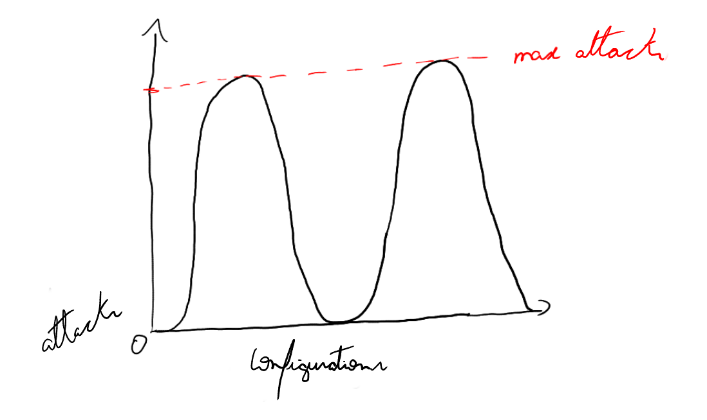
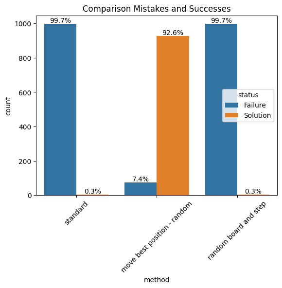
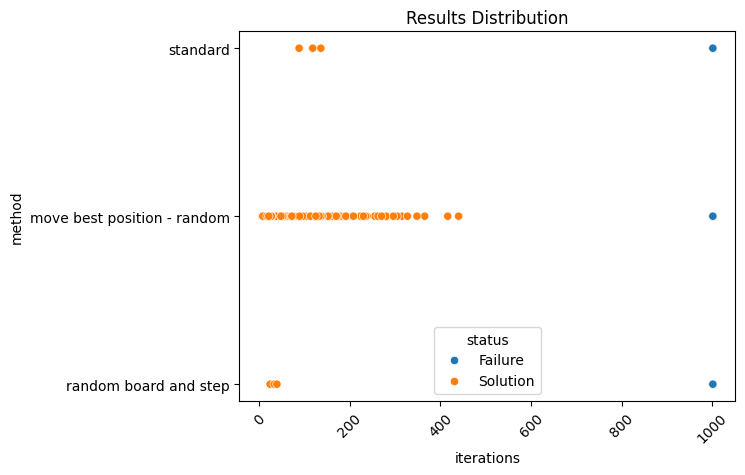

# Solving the local optima problem - NQueens

<div align="center">
  <a href="./readme-en.md">en-us</a>
  |
  <a href="./Readme.md">pt-br</a>
</div>

During our IA classes, we were studying about searching algorithms, more specifically the informed search algorithm `Hill Climbing`. To learn about this algorithm, we implemented it to solve the `N-Queens` problem. We saw that this a good algorithm to solve this problem quickly, but it's prone to get stuck on local optima.

Due to that, our professor [João Ricardo Favan](https://scholar.google.com.br/citations?user=fm6GR6YAAAAJ) challenged us to find a way to reduce the chances of getting stuck in a local minimum solution, and that's why I'm here.

---

In this repository, I'll show you the solution we found as well as the code we used to implement it.

For more details on the results, check out these files:

* [NRainhas.ipynb](./Nrainhas.ipynb)
* [benchmarks.csv](./benchmarks.csv): All the saved experiment results

## Thinking about the problem

The current implementation made by our professor is the following:

1. We generate a $n*n$ board with all queens on the left side
2. Calculate the amount of attacks
3. We check whether the amount of attacks reached the minimum we wanted (total of $0$ attacks)\
    3.1. if we reached, we stop here (global optima reached)
4. Once an optimal solution wasn't found, we a queen randomly and do all again starting from 2.

----

In the case of the `NQueens` problem, we could think in a representation like this one:



Looking at the chart, we can see that every board configuration $x$ raises a number of attacks $y$, in other words $f(x)=y$.

Once our goal in `NQueens` is to make no queens be attacked, we could have multiple configurations that are considered global optima.

This way, our problem doesn't necessarily have a local optima but, by the nature of this implementation, it's not guaranteed that it'll find any of these global solutions. Therefore, the algoritmo can, many times, get stuck in a point while climbing the hill and never reach the top indeed.

## Solutions

To solve this problem, we here propose 3 possible solutions.

### Solution 1 - Remove the random step

Once the implementation make the next step randomly, we are not sure if the set of possible configurations are properly being explored. So, even executing it $10000$ times, there's always some chance of not founding the maximum point.

To solve that, we could move the queens in a coordinated manner. We can move the queens to the left or to the right based on how many attacks each position raises, choosing the position with less attacks.

Even thought it's a good solution for this problem, we could get configuration that aren't able to evolve. To solve this issue, we check whether the current board is the same as the previous one. If it is, we move a queen randomly. Doing that, the algorithm has always something to improve, increasing the chances of finding a solution.

The code for it is the following:

```python
def moveQueenBestPosition(state):
  size=len(state)

  for i,j in locateQueens(state):

    new_j = j 
    min_attacks = calAttacks(state)
    best_state = state

    for possible_j in range(size):
      if possible_j == j: continue

      tmp_state = copy.deepcopy(state)
      tmp_state[i][j], tmp_state[i][possible_j] = tmp_state[i][possible_j], tmp_state[i][j]
      attacks = calAttacks(tmp_state)
      if(attacks < min_attacks):
        min_attacks = attacks
        new_j = possible_j
        best_state = tmp_state

    state = best_state      

  return state


def hillClimbing_s1(state, step, maxI):
  c=0
  n=len(state[0])
  maxAttacks = math.factorial(n)/(2*math.factorial(n-2))
  attacks = []
  while c <= maxI:
    att = calAttacks(state)
    attacks.append(maxAttacks - att)
    if att == 0:
      return "Solution", state, att, attacks, step, c

    nex = moveQueenBestPosition(copy.deepcopy(state))

    if nex == state:
      nex = moveRandomQueen(state, step)

    state = nex

    c += 1
  return "Failed", state, att, attacks, step, c
```

### Solution 2 - Random boards and steps

For the second solution, we used the same algorithm as the default one, but this time, we started our search using a random configuration and a random step within the interval $[1, n-1]$ being $n$ the width of the board.

Using this method, we incentive the algorithm to try new possibilities e so avoiding local optima.

The code for this one is the following:
```python
def random_board(size):
    board = generate_board(size)
    step = 1
    for _ in range(size):
        board = moveRandomQueen(copy.deepcopy(board), step) 
    return board

def hillClimbing_s2(board_size):
    board = random_board(board_size)
    step = random.randint(1, board_size-1)
    result = hillClimbing(board, step, 1000)
    return result
```

### Solution 3 - Other algorithms

The solution that could improve the values in this case, would be using a different algorithm that's not as prone to local optima as this one.

Algorithms like `Simulated Annealing`, `Genetic algorithms`, or even blind search, could be good options, even thought the performance maybe is not the better.

## Comparing

The solutions were test side by side with the standard version. For means of comparison, we executed the $3$ version $1000$ times in $9x9$ boards e saved the results.

### Mistakes and successes



Comparing the amount of mistakes and successes, there's not doubt that the first solution as the best of all. Your greedy method showed up as much effective for this given problem, finding the solution most part of the time.

Another interesting fact to see is that, even being a promising solution, the second one wasn't able to have any gain in comparison to the `Hill Climbing`'s standard method.

### Iterations distribution

Moreover, we verified which one was able to reach the result with less iterations.



In this case, we can see that the first version can find the solution with less iterations, but, due to its random method, with more scattered values.

On the other hand, the last method can find the configuration before the standard one. That's because we're giving random steps sizes, so the algorithm has more chances to find the solution with a small amount of iterations.


----

In general, the solutions with the smallest numbers of iterations were:

method | iterations | step size
-------|--------|------------------
standard | 88 | 1
solution 1 | 6 | 1
solution 2 | 24 | 6


### Complexity

Even with the better result shown, we must consider the complexity for each version.

At first, before stipulate the complexity of each one, we need to define primitives and the complexity of auxiliary functions.

As primitives, we're going to define the functions `calAttacks()` and `locateQueens()`, once for our analysis they won't influence, since they'll always be called $n$ time in the worst case scenario. So, for this analysis, we gonna treat them as $O(1)$.

For the auxiliary functions, we define them complexities as:

| function | complexity |
|--------|--------------|
| `moveRandomQueen()` | $O(1)$, since the next cell is always free |
| `moveQueenBestPosition()` | $O(n^2)$, being $n$ the width of the board |

---

With this information in our hands, the stipulated complexity for each version is:

| version | complexity |
|--------|--------------|
| standard | $O(r)$, being $r$ the maximum of iterations |
| solution 1 | $O(r* (n^2))$ |
| solution 2 | $O(r)$ | 

Therefore, the best algorithm in execution time is the `Solution 2`, since it can find the best configuration with less iterations, as seen before, having the same time complexity as the standard one.

However, once our goal is to find the correct result most part of the time, the `Solution 1` is still the best, doing a trade off of `time-solution`.

## Conclusion

Have been seen the results, there's no doubt the `Solution 1` is the one which can do better in the `N-Queens` problem. Nonetheless, this solution is not efficient from the point of view of complexity.


## People responsible for the Materials

All materials presented here were done by us and our professor.